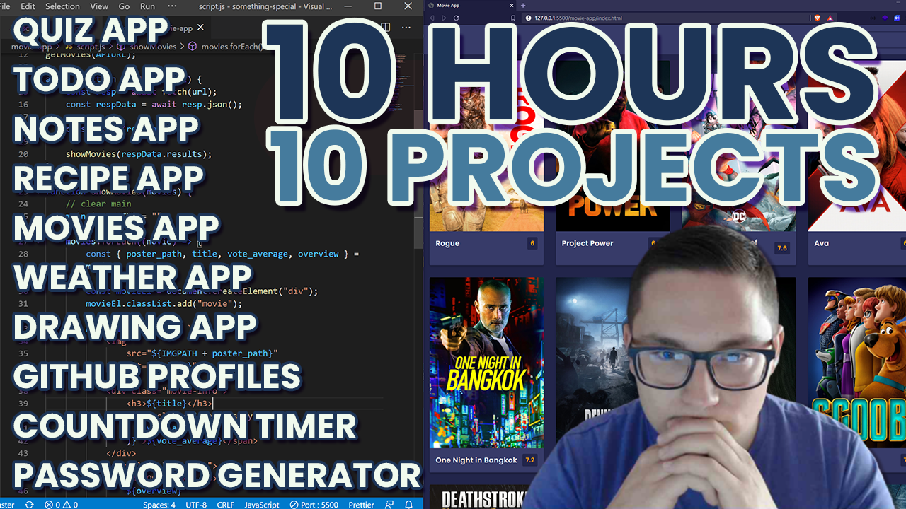

# 10 JavaScript Projects Collection  

This repository contains 10 interactive JavaScript projects inspired by the "10 Projects in 10 Hours" challenge by Florin Pop. Each project is built using HTML, CSS, and JavaScript, showcasing various web development techniques and functionalities.  

## Projects  

### 1. Countdown Timer  
A simple countdown timer where users can input a future date and see a live countdown.  
Design Inspiration: [UIDesignDaily](https://uidesigndaily.com/posts/sketch-countdown-timer-day-876)  

### 2. Quiz App  
A multiple-choice quiz application where users answer questions and receive a final score.  
- Questions stored in an object  
- Users select an answer  
- Score displayed at the end  
Design Inspiration: [UIDesignDaily](https://uidesigndaily.com/posts/sketch-questionnaire-choice-submit-day-924)  

### 3. Recipe App  
An interactive recipe app that displays recipes and allows users to save favorites using localStorage.  
- View recipe details  
- Favorite recipes persist using localStorage  
Design Inspiration: [UIDesignDaily](https://uidesigndaily.com/posts/sketch-recipe-app-food-mobile-day-615)  

### 4. Notes App  
A simple note-taking app with CRUD (Create, Read, Update, Delete) functionality and Markdown support.  
- Notes saved with localStorage  
- Edit and delete notes  
Design Inspiration: [UIDesignDaily](https://uidesigndaily.com/posts/photoshop-notes-widget-day-65)  

### 5. To-Do App  
A task management app with CRUD functionality and persistent storage.  
- Add, edit, delete tasks  
- Data stored in localStorage  
Design Inspiration: [TodoMVC](http://todomvc.com/examples/react/#/)  

### 6. Movie App  
A movie browsing app where users can explore movie details and save favorites.  
- Movie listing with details  
- Favorite movie functionality  
- Actor information  
Design Inspiration: [UIDesignDaily](https://uidesigndaily.com/posts/photoshop-movie-app-mobile-day-193)  

### 7. GitHub Profiles App  
A simple app to search GitHub user profiles and display their public data.  
- Search users  
- Show GitHub data (repos, followers, etc.)  
Design Inspiration: [UIDesignDaily](https://uidesigndaily.com/posts/photoshop-profile-card-user-day-286)  

### 8. Drawing App  
A basic drawing canvas with adjustable brush size and color selection.  
- Users can draw freely on canvas  
- Change brush size and color  

### 9. Password Generator  
A secure password generator with customizable options.  
- Choose length, numbers, letters, and symbols  
- Copy password to clipboard  
Design Inspiration: [CodePen](https://codepen.io/FlorinPop17/full/BaBePej)  

### 10. Weather App  
A weather app that fetches real-time weather data based on user input.  
- Enter location and fetch weather data  
- Displays temperature, humidity, and weather icons  
Design Inspiration: [UIDesignDaily](https://uidesigndaily.com/posts/photoshop-weather-prognosis-day-156)  

## How to Use  
1. Clone this repository:  
   ```bash
   git clone https://github.com/your-username/10-javascript-projects.git
   ```
2. Open the project folder and navigate to the desired project.  
3. Open the `index.html` file in your browser to see the project in action.  

## Technologies Used  
- HTML – Structure  
- CSS – Styling & UI  
- JavaScript – Functionality  

## Demo  
Watch the original 10 Projects in 10 Hours challenge on YouTube:  
[](https://www.youtube.com/watch?v=dtKciwk_si4)  

Live demo available [here](https://10projects10hours.netlify.app/)  